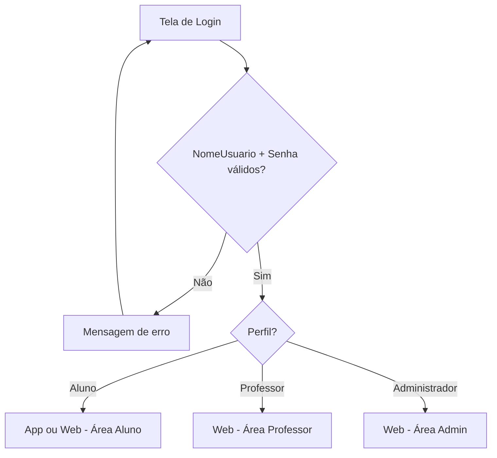
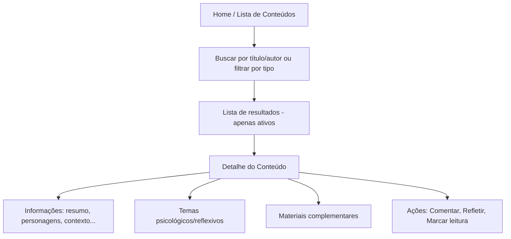
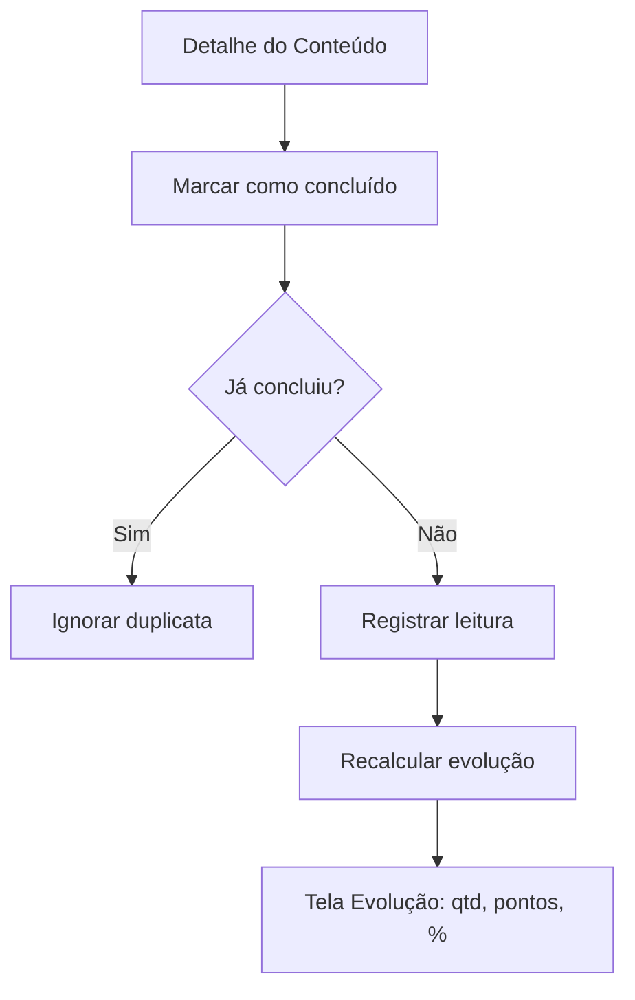
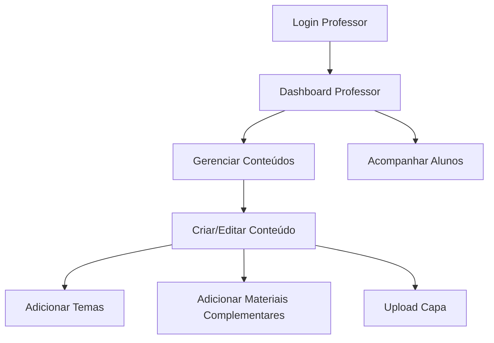
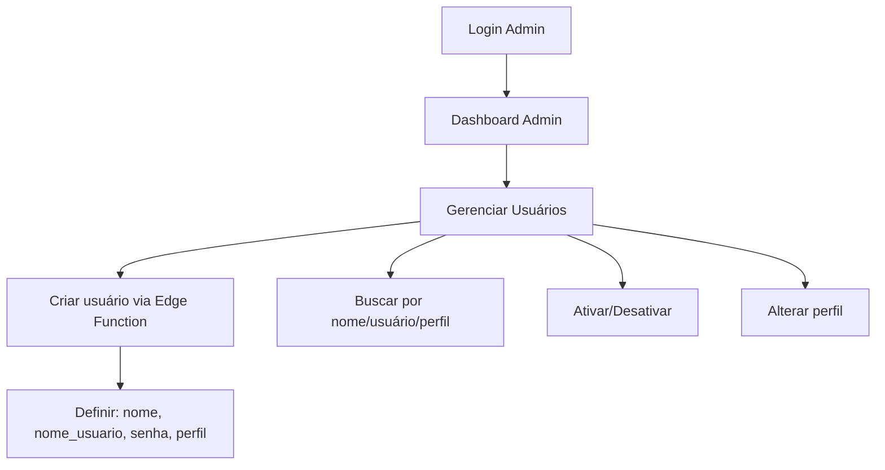

# Fluxos de uso — tcc-sistema

Fluxos principais por perfil. Referência para implementação de rotas e telas.

## 1. Autenticação (todos os perfis)

**Regras:**
- Usuário inativo → login bloqueado
- Logout disponível em perfil/configurações

---

## 2. Aluno — Consultar conteúdo (RF007)

---

## 3. Aluno — Interação (RF008)

### Comentário livre

1. Aluno abre detalhe do conteúdo
2. Seleciona "Comentário livre"
3. Escreve texto
4. Sistema salva com `tipo_interacao = comentario_livre`
5. Aluno pode editar depois

### Reflexão orientada

1. Aluno visualiza tema com questionamento
2. Seleciona "Reflexão orientada"
3. Responde ao questionamento (TemaID obrigatório)
4. Sistema salva com `tipo_interacao = reflexao_orientada`

---

## 4. Aluno — Leitura e evolução (RF009, RF010)

- Evolução visível na tela dedicada e no perfil (RF015)

---

## 5. Aluno — Produção autoral (RF011, RF012)

### Produção individual

1. Aluno acessa "Minhas produções"
2. Cria nova (tipo, título, texto)
3. Salva (pode continuar depois)
4. Edita apenas as próprias

### Obra autoral

1. Aluno cria obra (título, descrição)
2. Vincula produções existentes
3. Define ordem das produções
4. Visualiza obra organizada

---

## 6. Professor — Gerenciar conteúdos (RF004–RF006)

---

## 7. Professor — Acompanhar alunos (RF013)

1. Professor acessa lista de alunos
2. Seleciona aluno
3. Visualiza: conteúdos concluídos, pontuação, última interação
4. Pode visualizar reflexões/produções (conforme permissão institucional)
5. **Não altera** histórico manualmente

---

## 8. Administrador — Gerenciar usuários (RF001, RF003)

---

## 9. Administrador — Visão geral (RF014)

1. Admin acessa dashboard
2. Visualiza contadores: usuários, alunos, professores, conteúdos
3. Acessa gerenciamento de usuários e conteúdos
4. Consulta audit logs

---

## 10. Perfil do usuário (RF015)

1. Usuário autenticado acessa perfil
2. Visualiza: nome, nome_usuario, perfil
3. Pode alterar senha (senha atual + nova senha)
4. Aluno vê resumo de evolução
5. Opção de logout

---

## 11. Mapa de telas (referência)

### Mobile (Aluno)

| Tela | RF |
|------|-----|
| Login | RF002 |
| Home / Conteúdos | RF007 |
| Detalhe do conteúdo | RF007, RF008, RF009 |
| Minha evolução | RF010 |
| Minhas produções | RF011 |
| Minha obra | RF012 |
| Perfil | RF015 |

### Web (Aluno)

Mesmas telas do mobile, layout responsivo (RNF03).

### Web (Professor)

| Tela | RF |
|------|-----|
| Dashboard | RF013 |
| Conteúdos (CRUD) | RF004 |
| Temas | RF005 |
| Materiais | RF006 |
| Alunos | RF013 |
| Perfil | RF015 |

### Web (Administrador)

| Tela | RF |
|------|-----|
| Dashboard | RF014 |
| Usuários | RF001, RF003 |
| Conteúdos | RF004 (herda professor) |
| Audit logs | RS007 |
| Perfil | RF015 |
